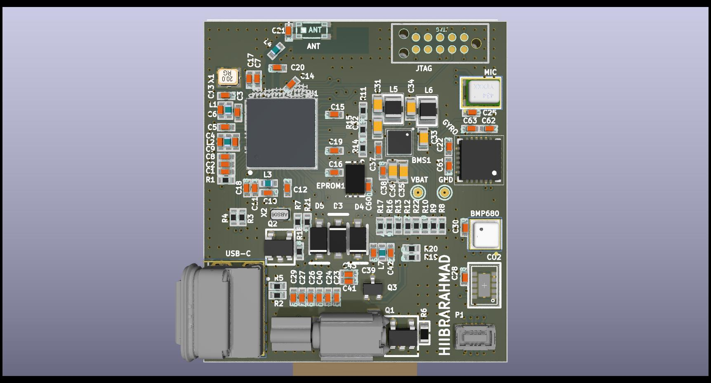
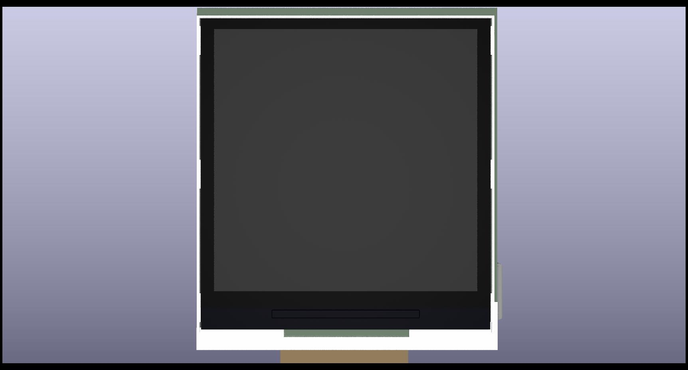
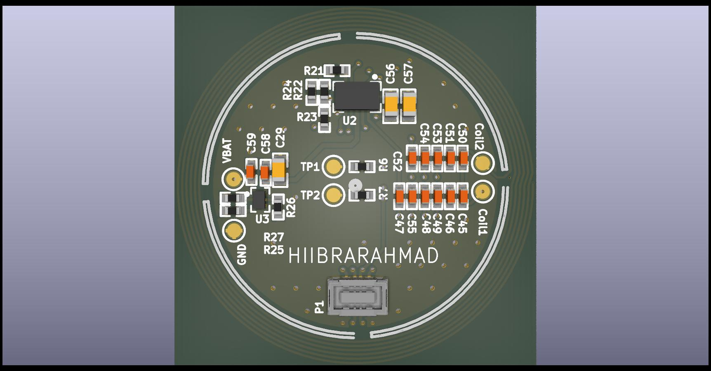
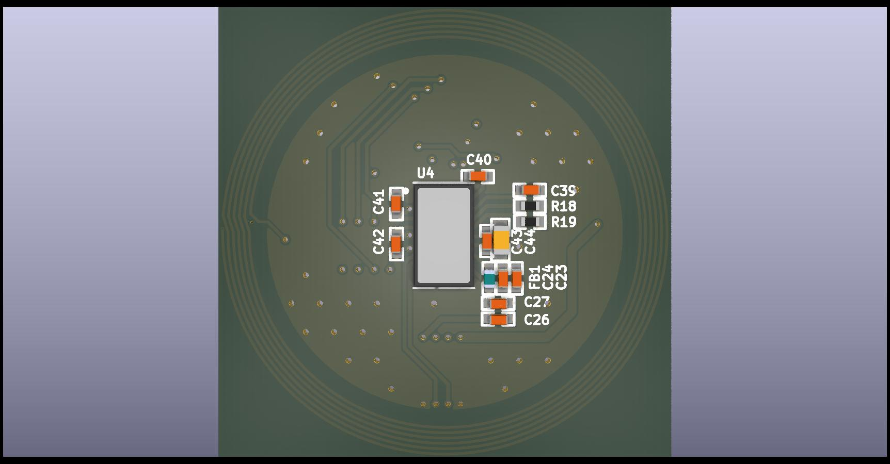

# ⚡ PRJ-PCB-1005-2024-SmartWatch
### Dual-Board Smart Watch PCB — Main Board & Wireless Charging Board
**Designed by hiibrarahmad · Powered by nRF5340 SoC**

[](#)
[-ff6b35?style=for-the-badge)](#)
[](#)
[](#)
[](#)
[-f59e0b?style=for-the-badge)](#)
[](#)
[](../../commits/main)
[](https://hiibrarahmad.github.io/PRJ-PCB-1005-2024-SmartWatch.github.io/)
[](https://github.com/hiibrarahmad/PRJ-PCB-1005-2024-SmartWatch.github.io)

[🔬 Interactive PCB View](https://hiibrarahmad.github.io/PRJ-PCB-1005-2024-SmartWatch.github.io/) · [📋 Project Assets](https://github.com/hiibrarahmad/PRJ-PCB-1005-2024-SmartWatch.github.io/tree/main/IMAGES) · [📦 3D Model — Charger Board (STEP)](assets/SensCharger.step)

> [!NOTE]
> A real 3D model exists for the **Charger Board** only (`assets/SensCharger.step`, exported from the source design). No STEP export exists yet for the Main Board.

---

## 📖 Project Overview

**PRJ-PCB-1005-2024-SmartWatch** is a **compact dual-board smart watch platform** featuring a main application board with a color IPS/e-Paper display and a dedicated wireless charging board with Qi inductive charging support. Designed around the **Nordic Semiconductor nRF5340** dual-core SoC, this wearable platform integrates Bluetooth 5.3, health sensing (PPG + SpO2 + ECG), environmental monitoring, CO₂ sensing, and a full IMU — all packed into a wristwatch form factor.

> 💡 The **Main Board** hosts the nRF5340 SoC and all application peripherals including display, sensors, and connectivity. The **Charger Board** provides wireless Qi charging reception via BQ51003, battery management via BQ25100, and PPG/SpO2 sensing via MAX86150.

---

## 🖼️ PCB Preview


| 🔝 Top Side | 🔻 Bottom Side |
|-------------|----------------|
|   |  |

### 🔋 Charger Board — Top & Bottom

| 🔝 Top Side | 🔻 Bottom Side |
|-------------|----------------|
|  |  |

🔗 **[→ View Interactive PCB Online](https://hiibrarahmad.github.io/PRJ-PCB-1005-2024-SmartWatch.github.io/)**

---

## 🎯 Core Design Goals

| Goal | Specification |
|------|--------------|
| ⌚ **Wearable Form Factor** | Ultra-compact dual-board stack for wristwatch enclosure |
| 🖥️ **Dual Display Support** | 1.54" IPS Color LCD + 1.54" e-Paper (low-power mode) |
| 📡 **Wireless Connectivity** | Bluetooth 5.3 (nRF5340), 2.4 GHz antenna |
| 🔋 **Wireless Charging** | Qi inductive charging via BQ51003 receiver |
| 💓 **Health Sensing** | PPG, SpO2, ECG via MAX86150 |
| 🌡️ **Environmental Sensing** | Temperature, Humidity, Pressure, Gas (BME680) |
| 💨 **Air Quality** | CO₂ / eCO₂ / TVOC sensing via CCS811 |
| 🏃 **Motion Sensing** | 6-axis IMU via ICM-20689 |
| 🔒 **Security** | ARM TrustZone on Cortex-M33, Secure Boot |

---

## 💻 nRF5340 SoC — Main Processor

This board is built around the **Nordic Semiconductor nRF5340** — the world's first dual-core Bluetooth 5.3 SoC for advanced wearable applications.

| Category | Specification |
|----------|--------------|
| 🧮 **Application Core** | ARM® Cortex®-M33 @ 128 MHz, TrustZone, FPU, DSP |
| 🌐 **Network Core** | ARM® Cortex®-M33 @ 64 MHz (dedicated BLE/radio control) |
| 💾 **Flash** | 1 MB (App) + 256 KB (Net) |
| 🗃️ **RAM** | 512 KB (App) + 256 KB (Net) |
| 📡 **Bluetooth** | BT 5.3 LE, Long Range, Bluetooth Mesh, Direction Finding |
| 🔐 **Security** | ARM TrustZone, Secure Boot, CryptoCell-312, ARM PSA Level 2 |
| 🔌 **USB** | Full Speed USB 2.0 with integrated PHY |
| 📟 **Serial I/O** | 4× UARTE · 5× SPI/I2C · I2S · PDM · 32× GPIO |
| ⚡ **Operating Voltage** | 1.7V – 5.5V |
| 📐 **Package** | QKA (7×7 mm, 94-pin AQFN) |
| 🌡️ **Operating Temp** | −40°C to +85°C |

---

## 🔌 PCB Interface Map

### 🖥️ Display Interfaces
- **SPI** → 1.54" IPS TFT Color LCD (ER-TFT1.54-1) — always-on mode
- **SPI** → 1.54" e-Paper Display (GDEW0154T8DE) — ultra-low-power ambient mode
- Dedicated SPI bus with chip selects for each display

### 💓 Health & Bio-Sensing
- **I2C** → MAX86150 (PPG, SpO2, ECG analog front-end) on Charger Board
- Optical heart rate monitoring
- Single-lead ECG acquisition

### 🌡️ Environmental Sensing
- **I2C** → BME680 (Temperature · Humidity · Barometric Pressure · Gas/VOC)
- **I2C** → CCS811 (eCO₂ and TVOC Air Quality Sensor)

### 🏃 Motion & Audio
- **SPI** → ICM-20689 (6-DoF IMU: 3-axis Gyroscope + 3-axis Accelerometer)
- **PDM** → ICS-43432 Digital MEMS Microphone

### 🔋 Power & Charging System
- **Qi Wireless Charging** via BQ51003 receiver IC (Charger Board)
- **Battery Management** via BQ25100 Li-Ion charger (Charger Board)
- VBAT battery rail with test points
- Coil1 / Coil2 wireless coil interface pads
- BLM15AX102SN1D EMI Ferrite Bead Filter on power rail

### 💾 Storage
- **SPI** → M95512-A125 (512 Kbit / 64 KB SPI EEPROM)

### 🔗 Connectivity & Debug
- **USB-C** → 2305018-2 connector (USB Full Speed, charging & data)
- **SWD/JTAG** → FTSH-105-01-F-DV-K-TR debug header (2×5, 1.27 mm)
- **RF** → 2450AT18D0100 2.4 GHz chip antenna
- **GPIO** → Board-to-board connector (P1, 50500408125)

### ⏱️ Clocking
- **X1** → 32 MHz crystal (2016 package) — Primary RF and CPU clock
- **X2** → 32.768 kHz crystal (2012 package) — RTC and low-power sleep clock

---

## 📋 Bill of Materials Summary

### 🟦 Main Board (PRJ-PCB-1005-2024-SmartWatch)

| Category | Key Components | Qty |
|----------|---------------|-----|
| 🧠 **MCU** | nRF5340-QKA (Nordic) | 1 |
| 🖥️ **Display** | ER-TFT1.54-1 (1.54" IPS) + GDEW0154T8DE (1.54" e-Paper) | 2 |
| 📡 **RF Antenna** | 2450AT18D0100 (2.4 GHz chip antenna) | 1 |
| 🏃 **IMU** | ICM-20689 (6-axis, QFN) | 1 |
| 🌡️ **Env. Sensor** | BME680 (Temp/Hum/Press/Gas) | 1 |
| 💨 **Air Quality** | CCS811B-JOPR (CO₂/TVOC) | 1 |
| 🎙️ **Microphone** | ICS-43432 (Digital PDM MEMS) | 1 |
| 💾 **EEPROM** | M95512-A125 (512 Kbit SPI) | 1 |
| 🔌 **USB-C** | 2305018-2 Connector | 1 |
| 🔧 **Debug** | FTSH-105-01-F-DV-K-TR (SWD/JTAG) | 1 |
| 🔮 **MOSFET** | BC816-25HV + Si1308EDL (SOT23/SOT323) | 3 |
| ⏱️ **Crystals** | 32 MHz (X1) + 32.768 kHz (X2) | 2 |
| ⚡ **Diodes** | MBR0530 Schottky (SOD-123) | 3 |
| 📦 **Passives** | Resistors, Capacitors (0402/0603), Inductors | ~65 |

### 🟧 Charger Board (PRJ-PCB-1005-2024-SmartWatch-Charger)

| Category | Key Components | Qty |
|----------|---------------|-----|
| 🔋 **Wireless Rx** | BQ51003YFPR (Qi receiver IC) | 1 |
| ⚡ **Battery Charger** | BQ25100YFPT (Li-Ion charger) | 1 |
| 💓 **Health Sensor** | MAX86150EFF+ (PPG/SpO2/ECG AFE) | 1 |
| 🔌 **Board Connector** | P1 50500408125 | 1 |
| 🔧 **EMI Filter** | BLM15AX102SN1D (Ferrite Bead) | 1 |
| 📦 **Passives** | Resistors, Capacitors (0402/0603) | ~35 |

---

## 📐 PCB Specifications

### Main Board

| Parameter | Value |
|-----------|-------|
| PCB Definition | Main Application Board |
| Layer Count | 4 Layers |
| Material | FR4 |
| Surface Finish | Immersion Gold (ENIG) |
| Solder Mask | Top & Bottom · Color: Green |
| Silkscreen | Top & Bottom · Color: White |
| Impedance Control | ✅ Yes |
| RoHS | ✅ Compliant |

### Charger Board

| Parameter | Value |
|-----------|-------|
| PCB Definition | Wireless Charging Board |
| Layer Count | 4 Layers |
| Material | FR4 |
| Surface Finish | Immersion Gold (ENIG) |
| Solder Mask | Top & Bottom · Color: Green |
| Silkscreen | Top & Bottom · Color: White |
| Impedance Control | ✅ Yes |
| RoHS | ✅ Compliant |

---

## 🧱 PCB Stack-Up

```
┌─────────────────────────────────────────┐
│  TOP LAYER     │  CU     │ 0.035 mm (1.4 mil)  │
├─────────────────────────────────────────┤
│  PREPREG       │         │ 0.066 mm (2.6 mil)  │
├─────────────────────────────────────────┤
│  LAYER 1       │  CU     │ 0.035 mm (1.4 mil)  │  ← GND Reference
├─────────────────────────────────────────┤
│  PREPREG       │         │ 1.27 mm  (50 mil)   │  ← CORE
├─────────────────────────────────────────┤
│  LAYER 2       │  CU     │ 0.035 mm (1.4 mil)  │  ← Power / GND
├─────────────────────────────────────────┤
│  PREPREG       │         │ 0.066 mm (2.6 mil)  │
├─────────────────────────────────────────┤
│  BOTTOM LAYER  │  CU     │ 0.035 mm (1.4 mil)  │
└─────────────────────────────────────────┘
```

---

## 📏 Impedance Control Reference

| Target Impedance | Layer | Trace Width / Gap |
|-----------------|-------|-------------------|
| 50 Ω ±10% | TOP LAYER | 4 mil (single-ended RF) |
| 50 Ω ±10% | BOTTOM LAYER | 4 mil (single-ended) |
| 90 Ω ±10% | TOP LAYER | 4.495 mil / 4 mil (USB diff pair) |
| 90 Ω ±10% | BOTTOM LAYER | 4.495 mil / 4 mil |

> ⚠️ All high-speed signals (USB Full Speed, SPI @ >10 MHz, RF traces) are impedance-controlled. Reference layers: **TOP → Layer 1**, **BOTTOM → Layer 2**. RF trace from nRF5340 to antenna must be routed as 50 Ω microstrip.

---

## ⌚ Smart Watch — Feature Requirements

The dual-board platform is designed to fulfill the following product-level requirements:

- ✅ Compact wristwatch form factor — dual stacked PCB design
- ✅ Dual display: color IPS LCD for active use + e-Paper for ambient/always-on
- ✅ Bluetooth 5.3 wireless connectivity (nRF5340)
- ✅ Wireless Qi charging via dedicated charger board
- ✅ Li-Ion battery management with USB-C fallback charging
- ✅ Optical heart rate, SpO2, and ECG health monitoring
- ✅ Environmental monitoring: temperature, humidity, pressure, gas
- ✅ CO₂ and air quality monitoring (CCS811)
- ✅ 6-axis motion sensing for step counting, gesture, and activity tracking
- ✅ Digital MEMS microphone for voice interaction
- ✅ ARM TrustZone security for health data protection
- ✅ OTA firmware update via Bluetooth (Nordic DFU)
- ✅ SWD/JTAG debug interface for development

---

## 🛠️ Software & Firmware

| Component | Details |
|-----------|---------|
| **RTOS** | Zephyr RTOS (Nordic SDK) |
| **BLE Stack** | SoftDevice / BLE 5.3 (nRF5340 Network Core) |
| **SDK** | nRF Connect SDK (NCS) |
| **Bootloader** | MCUboot (Secure OTA) |
| **Security** | TF-M (Trusted Firmware-M), ARM PSA Level 2 |
| **Health APIs** | PPG/SpO2/ECG via MAX86150 driver |
| **Sensor Drivers** | BME680, CCS811, ICM-20689 Zephyr drivers |
| **Display Stack** | LVGL (GUI framework for wearable UI) |
| **BLE Profiles** | HRS, HTS, DIS, BAS, Custom Health Service |
| **OTA Updates** | Nordic DFU over BLE |

---

## 📁 Repository Structure

```
PRJ-PCB-1005-2024-SmartWatch.github.io/
│
├── IMAGES/
│   ├── PRJ-2026-PCB-0002-SMART_WATCH.jpg          ← Main Board Top (JPG)
│   ├── PRJ-2026-PCB-0002-SMART_WATCHBOT.jpg       ← Main Board Bottom (JPG)
│   ├── PRJ-2026-PCB-0002-SMART_WATCH-CHARGER.jpg  ← Charger Board Top (JPG)
│   └── PRJ-2026-PCB-0002-SMART_WATCH-CHARGERBOT.jpg ← Charger Board Bottom (JPG)
│
├── index.html      ← Board picker (Main Board / Wireless Charger Board)
├── main.html       ← Main board interactive PCB/BOM viewer
├── charger.html    ← Wireless charger board interactive PCB/BOM viewer
└── README.md       ← This file
```

---

## 🔗 Links

| Resource | URL |
|----------|-----|
| 🌐 **Interactive PCB View** | [hiibrarahmad.github.io/PRJ-PCB-1005-2024-SmartWatch.github.io](https://hiibrarahmad.github.io/PRJ-PCB-1005-2024-SmartWatch.github.io/) |
| 📦 **nRF5340 SoC** | [Nordic Semiconductor nRF5340](https://www.nordicsemi.com/products/nrf5340) |
| 📝 **nRF Connect SDK** | [developer.nordicsemi.com](https://developer.nordicsemi.com) |
| 📜 **License** | Proprietary — © 2026 hiibrarahmad. All Rights Reserved. |

---

<div align="center">

**PRJ-PCB-1005-2024-SmartWatch**

*Dual-Board Smart Watch Platform · Main Board + Wireless Charger Board*

[](#)
[](#)
[](#)

© 2026 hiibrarahmad. All Rights Reserved.

</div>
